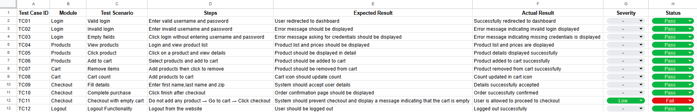
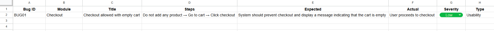

# Manual Testing Project – SauceDemo

## 📌 Project Overview
This project involves manual testing of the SauceDemo e-commerce web application. The goal was to validate core functionalities such as login, product selection, cart operations, and checkout.

## 👤 Role
Performed end-to-end manual functional testing and documented results for SauceDemo application

## 🌐 Application Tested
https://www.saucedemo.com/

## 🧪 Testing Approach
- Designed and executed test cases for:
  - Login
  - Products
  - Cart
  - Checkout
  - Logout
- Compared expected vs actual results
- Identified and documented defects

## 📊 Test Summary
- Total Test Cases: 12
- Passed: 11
- Failed: 1

## 📸 Sample Screenshots
Test Cases:

Bug Report:

## 🔍 Key Finding
Checkout process allows users to proceed without adding items to the cart (Usability Issue)

## 📁 Files Included
- [Test Cases (PDF)](Test_Cases.pdf)
- [Bug Report (PDF)](Bug_Report.pdf)

## 🛠 Tools Used
- Google Sheets / Excel
- Manual Testing Techniques
